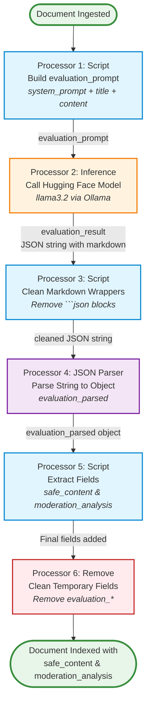

# Content Moderation Pipeline Flow



## Pipeline Stages Explained

### Stage 1: Build Prompt (Script)
- **Input**: Document fields (`title`, `content`)
- **Action**: Concatenates system prompt with article data
- **Output**: `evaluation_prompt` (text string)
- **Purpose**: Prepare the complete prompt for the LLM

### Stage 2: Model Inference
- **Input**: `evaluation_prompt`
- **Action**: Calls Hugging Face endpoint (Ollama/llama3.2)
- **Output**: `evaluation_result` (JSON wrapped in markdown)
- **Purpose**: Get AI-powered content moderation decision

### Stage 3: Clean Markdown (Script)
- **Input**: `evaluation_result`
- **Action**: Removes markdown code block wrappers (` ```json `)
- **Output**: Clean JSON string
- **Purpose**: Prepare for JSON parsing

### Stage 4: JSON Parser
- **Input**: Cleaned JSON string
- **Action**: Converts string to object
- **Output**: `evaluation_parsed` (object)
- **Purpose**: Make data accessible for field extraction

### Stage 5: Extract Fields (Script)
- **Input**: `evaluation_parsed`
- **Action**: Extracts `safe_content` and `moderation_analysis`
- **Output**: Document with final fields
- **Purpose**: Store moderation results in final schema

### Stage 6: Cleanup (Remove)
- **Input**: Document with all fields
- **Action**: Removes temporary fields (`evaluation_*`)
- **Output**: Clean final document
- **Purpose**: Keep only necessary fields in index
